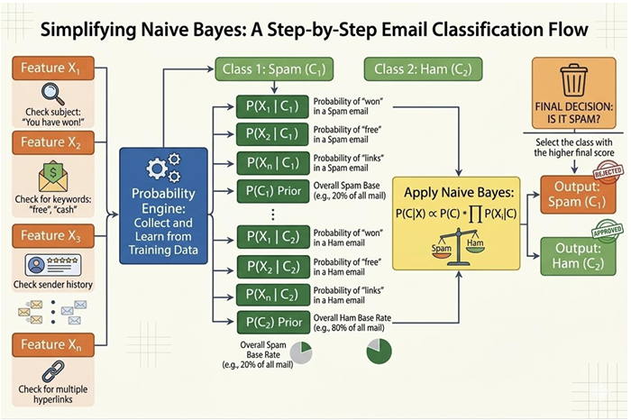

Naive Bayes is a supervised probabilistic learning algorithm widely used for text classification tasks 
such as spam and ham message detection. The model is based on Bayes’ theorem, which estimates 
the posterior probability of a class given observed features. A key assumption of Naive Bayes is that 
features are conditionally independent given the class label. While this assumption does not fully hold 
for natural language, the classifier remains effective due to the high dimensionality and sparse 
distribution of textual features. 

### 1. Bayes’ Theorem 
Bayes’ theorem is a fundamental probability rule that describes how to update the probability of a 
hypothesis based on new evidence. It forms the mathematical foundation of the Naive Bayes classifier. 
The theorem is expressed as: 

    
        <i>P</i>(<i>C</i> | <i>X</i>) = 
        

            
<i>P</i>(<i>X</i> | <i>C</i>)<i>P</i>(<i>C</i>)

            
<i>P</i>(<i>X</i>)

        

    

where: 
- **P(C | X)** represents the posterior probability of a message belonging to class C (spam or ham) given the feature set X. 
- **P(X | C)** is the likelihood of observing the features under class C. 
- **P(C)** denotes the prior probability of the class. 
- **P(X)** is the marginal likelihood of the features. 

#### Prior Probability 
The prior probability P(C) represents the probability of a class occurring before observing any features. 
It is calculated from the training data as: 

    
        <i>P</i>(<i>C</i>) = 
        

            
Number of samples belonging to class <i>C</i>

            
Total number of samples

        

    

For example, in a spam detection dataset where 40% are spam and 60% are ham: 
- P(Spam) = 0.4 
- P(Ham) = 0.6 

#### Likelihood 
The likelihood P(X | C) represents the probability of observing a feature vector X when the class is C. 
In text classification, this corresponds to the probability of words appearing in messages belonging to 
a particular class. 

#### Posterior Probability 
The posterior probability P(C | X) is the updated probability of a class after considering the observed 
features. The classifier computes this value for each class and selects the class with the highest 
posterior probability: 

    
        <i>C</i>* = max <i>P</i>(<i>C</i> | <i>X</i>)
    

where C* is the predicted class. This approach is also referred to as Maximum A Posteriori (MAP) 
estimation, which chooses the class that maximizes the posterior probability: 

    
        MAP(<i>C</i>) = max [ <i>P</i>(<i>X</i> | <i>C</i>) <i>P</i>(<i>C</i>) ]
    

The classifier therefore only needs to compute the product of the likelihood and prior probability for 
each class and select the class with the highest value. 

### 2. Naive Independence Assumption 
The term "Naive" refers to the simplifying assumption that all features are conditionally independent 
given the class label. This means that the presence or absence of one feature does not influence 
another feature when the class is known. 

If the feature vector is represented as: 

    
        <i>X</i> = (<i>x</i>1, <i>x</i>2, <i>x</i>3, ..., <i>xn</i>)
    

then the likelihood can be simplified as: 

    
        <i>P</i>(<i>X</i> | <i>C</i>) = <i>P</i>(<i>x</i>1 | <i>C</i>) &times; <i>P</i>(<i>x</i>2 | <i>C</i>) &times; ... &times; <i>P</i>(<i>xn</i> | <i>C</i>)
    

This assumption significantly reduces computational complexity and allows the algorithm to work 
efficiently with large datasets. Instead of estimating the joint probability of all features together, which 
would require an exponentially large number of parameters, the model only needs to estimate the 
individual conditional probabilities of each feature. This makes Naive Bayes especially effective for 
high-dimensional data such as text. 

### 3. Naive Bayes Classifier 
The Naive Bayes classifier applies Bayes’ theorem together with the naive independence assumption 
to classify new instances. Given an input feature vector X = (x₁, x₂, …, xₙ), the classifier computes the 
posterior probability for each class and assigns the label of the class with the highest posterior 
probability. 

The classification rule is: 

    
        <i>C</i>* = argmax [ <i>P</i>(<i>C</i>) &times; &prod;<i>i</i>=1<i>n</i> <i>P</i>(<i>xi</i> | <i>C</i>) ]
    

To avoid numerical underflow when dealing with very small probability values, logarithms are applied: 

    
        <i>C</i>* = argmax [ log <i>P</i>(<i>C</i>) + &Sigma;<i>i</i>=1<i>n</i> log <i>P</i>(<i>xi</i> | <i>C</i>) ]
    

While the underlying principle remains consistent, different variants of the classifier are used 
depending on the nature of the data distribution and feature representation. 

**Multinomial Naive Bayes** 
Multinomial Naive Bayes is designed for discrete data, especially word counts or term frequencies. It 
is widely used in text classification tasks such as spam detection and document classification. Text is 
typically converted into numerical features using methods like bag-of-words or TF-IDF. 

**Gaussian Naive Bayes** 
Gaussian Naive Bayes is used when features are continuous numerical values assumed to follow a 
normal distribution. The likelihood is calculated using the Gaussian probability density function, using 
the mean and variance of the feature values for each class to measure how closely a value fits the 
distribution of that class. 

**Bernoulli Naive Bayes** 
Bernoulli Naive Bayes works with binary features, where each feature indicates whether a word is 
present (1) or absent (0) in a document. It is useful when the presence of certain keywords is more 
important than their frequency. 

**Categorical Naive Bayes** 
Categorical Naive Bayes is used when features are categorical variables with multiple possible values, 
such as colour, weather, or device type. Probabilities are calculated based on the frequency of each 
category within a class. 

### 4. Feature Transformation and Modeling 
Before applying the Naive Bayes classifier, raw data must be transformed into a suitable numerical 
representation depending on the nature of the features. 

**Categorical Features** 
Categorical features take discrete values from a fixed set (e.g., colour: red, blue, green). The 
probability of each category given a class is estimated from training data: 

    
        <i>P</i>(<i>xi</i> = <i>v</i> | <i>C</i> = <i>c</i>) = 
        

            
Count(<i>xi</i> = <i>v</i>, <i>C</i> = <i>c</i>)

            
Count(<i>C</i> = <i>c</i>)

        

    

Laplace smoothing is applied to avoid zero probabilities for unseen category values: 

    
        <i>P</i>(<i>xi</i> = <i>v</i> | <i>C</i> = <i>c</i>) = 
        

            
Count + 1

            
Total + Number of unique values

        

    

**Continuous Features (Gaussian NB)** 
When features are continuous, Gaussian Naive Bayes assumes values follow a normal distribution 
within each class. The mean (μ) and variance (σ²) are estimated from training data for each feature 
and class. The probability density function computes the likelihood: 

    
        <i>P</i>(<i>xi</i> | <i>C</i>) = 
        

            
1

            
&radic;2&pi;<i>&sigma;</i>2

        

        &times; exp
        (
        

            
&minus;(<i>xi</i> &minus; <i>&mu;</i>)2

            
2<i>&sigma;</i>2

        

        )
    

**Frequency-Based Features** 
Textual data is transformed into numerical vectors using Term Frequency–Inverse Document 
Frequency (TF-IDF) weighting. TF-IDF enhances the importance of words that are frequent within a 
document but infrequent across the entire corpus, improving the discriminative ability of the feature 
space. For classification, the Multinomial Naive Bayes algorithm is well suited for word-based features 
and TF-IDF representations. 

In text classification tasks, documents are represented using the bag-of-words model, where word 
occurrences form the basis of feature extraction and the order of words is ignored. For example, a 
message can be represented as shown in the table below: 

| Word | Frequency |
| :--- | :--- |
| free | 2 |
| win | 1 |
| offer | 1 |

To improve feature quality and reduce redundancy, Natural Language Processing (NLP) techniques are 
applied. These include: 
- **Text Normalization:** Standardizing text format. 
- **Stop Words Removal:** Filtering out common words (e.g., "is", "the") that carry little semantic value. 
- **Stemming and Lemmatization:** Reducing words to their base or root forms. 
- **Part-of-Speech (POS) Tagging:** Identifying grammatical roles to preserve semantic correctness while reducing dimensionality. 

### 5. Naïve Bayes Classification Workflow 

 
<strong>Figure 1: Workflow of Naïve Bayes classification for spam–ham email prediction</strong>

The figure 1 illustrates the workflow of the Naïve Bayes classifier used for email classification. In this 
process, an email is first analyzed by extracting several features such as the presence of certain 
keywords in the subject, specific terms in the message body, or patterns in the sender information. 
These extracted features represent the input variables that help characterize the email. Using training 
data, the classifier estimates the probabilities of these features occurring in each class, namely spam 
and ham. It also computes the prior probabilities of each class, which represent how frequently spam 
and ham emails appear in the dataset. 

Once these probabilities are learned, the Naïve Bayes algorithm applies Bayes’ theorem to compute 
the posterior probability of the email belonging to each class given the observed features. This 
involves combining the prior probability of the class with the conditional probabilities of the features. 
The classifier then compares the resulting probability scores for the spam and ham classes and assigns 
the email to the class with the higher probability. This probabilistic approach enables efficient and 
accurate classification of emails into spam or legitimate messages. 

### 6. Algorithm 
**Step 1:** Apply Bayes’ Theorem: 

    
        <i>P</i>(Class | Features) = 
        

            
<i>P</i>(Features | Class) &times; <i>P</i>(Class)

            
<i>P</i>(Features)

        

    

**Step 2:** Apply Naive Independence Assumption: 

    
        <i>P</i>(<i>x</i>1, <i>x</i>2, ..., <i>xn</i> | Class) = <i>P</i>(<i>x</i>1 | Class) &times; <i>P</i>(<i>x</i>2 | Class) &times; ... &times; <i>P</i>(<i>xn</i> | Class)
    

**Step 3:** During Training, calculate from data: 

- **Prior Probability:**

    
        <i>P</i>(Class = <i>c</i>) = 
        

            
Count of samples in class <i>c</i>

            
Total samples

        

    

- **Conditional Probability (for each feature):**

-    **For categorical features:**

    
        <i>P</i>(<i>xi</i> = <i>v</i> | Class = <i>c</i>) = 
        

            
Count(class <i>c</i> where feature <i>j</i> = <i>v</i>)

            
Count(class <i>c</i> samples)

        

    

-    **For continuous features (Gaussian NB):** 
Calculate mean (μ) and variance (σ²) of feature j for each class:

    
        <i>P</i>(<i>xi</i> | Class = <i>c</i>) = 
        

            
1

            
&radic;2&pi;<i>&sigma;</i>2

        

        &times; exp
        (
        

            
&minus;(<i>xi</i> &minus; <i>&mu;</i>)2

            
2<i>&sigma;</i>2

        

        )
    

**Step 4:** Add Laplace Smoothing (to handle zero probabilities): 

    
        <i>P</i>(<i>xi</i> = <i>v</i> | Class = <i>c</i>) = 
        

            
Count + 1

            
Total + Number of unique values

        

    

**Step 5:** For Prediction: 
- **For each class c, calculate:** 

    
        Score(<i>c</i>) = <i>P</i>(Class = <i>c</i>) &times; &prod;<i>i</i>=1<i>n</i> <i>P</i>(<i>xi</i> | Class = <i>c</i>)
    

- **Use log to avoid underflow:** 

    
        Log_Score(<i>c</i>) = log(<i>P</i>(Class = <i>c</i>)) + &Sigma;<i>i</i>=1<i>n</i> log(<i>P</i>(<i>xi</i> | Class = <i>c</i>))
    

- **Predict class with highest score.**

### 7. Applications: Text Classification and NLP 
Naive Bayes is particularly well suited for text classification problems. The high-dimensional and 
sparse nature of text data aligns naturally with the independence assumption, making the classifier 
both efficient and effective for NLP tasks. 

**Spam Detection** 
Naive Bayes is one of the earliest and most effective methods for email spam detection. Given a set 
of words in an email, the classifier computes the probability that the message belongs to the spam or 
ham class. Words such as "free", "offer", and "win" tend to have high probability under the spam class, 
while neutral vocabulary is more characteristic of ham messages. The model learns these probabilities 
from labelled training data and applies them to new, unseen messages. 

**Sentiment Analysis** 
In sentiment analysis, the goal is to determine whether a piece of text (such as a product review or a 
tweet) expresses a positive, negative, or neutral opinion. Naive Bayes can be trained on labelled 
sentiment data to estimate the likelihood of positive or negative words under each class. Due to its 
fast training speed, it is widely used as a baseline model for sentiment classification tasks. 

**Document Classification** 
Naive Bayes is also applied to categorize documents into predefined topics or genres, such as news 
articles into sports, politics, and technology. The bag-of-words or TF-IDF representation of documents 
is used as the feature set. The classifier assigns a document to the category with the highest posterior 
probability, and performs well when documents have clearly distinguishable vocabulary across 
categories. 

In all these text-based applications, NLP preprocessing techniques such as stop word removal, 
stemming, and TF-IDF weighting further enhance the performance of the Naive Bayes classifier by 
reducing noise and emphasizing discriminative features. 

### 8. Merits of Naive Bayes 
- **Simple and Computationally Efficient:** The algorithm requires only a single pass through the training data to estimate probabilities, making training and prediction extremely fast. 
- **Works Well with High-Dimensional Data:** Suitable when the number of features is very large, such as in text classification with thousands of words. The independence assumption prevents the curse of dimensionality. 
- **Performs Well with Small Datasets:** Unlike many other machine learning algorithms, Naive Bayes can yield good results even with a small amount of training data, as it only requires individual feature probabilities. 

### 9. Demerits of Naive Bayes 
- **Strong Independence Assumption:** Naive Bayes assumes all features are conditionally independent given the class. In practice this rarely holds — words like "bank" and "loan" in a document are related, yet the model treats them as independent. 
- **Performance Decreases When Features Are Highly Correlated:** When features are strongly correlated, the independence assumption is violated, leading to biased probability estimates and reduced classification accuracy. 
- **Limited Ability to Capture Complex Relationships:** Naive Bayes is a simple linear classifier and cannot model non-linear patterns or complex feature interactions. More sophisticated algorithms such as decision trees, random forests, or neural networks may outperform it on complex datasets. 

Overall, the Naive Bayes classifier, combined with NLP-based feature normalization and TF-IDF 
representation, provides an efficient and robust solution for spam and ham message classification. 
