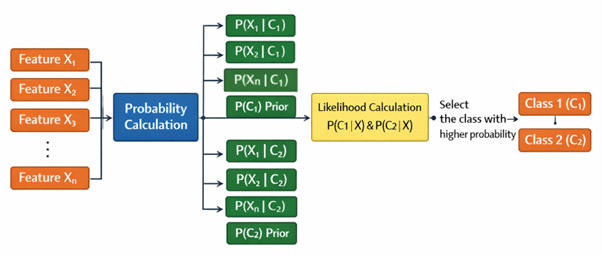

Naive Bayes is a supervised probabilistic learning algorithm widely used for text classification tasks such as spam and ham message detection. The model is based on Bayes' theorem, which estimates the posterior probability of a class given observed features. A key assumption of Naive Bayes is that features are conditionally independent given the class label. While this assumption does not fully hold for natural language, the classifier remains effective due to the high dimensionality and sparse distribution of textual features.

### 1. Bayes' Theorem
Bayes' theorem is defined as:

    <strong>P(C | X) = </strong>
    

        
P(X | C) P(C)

        
P(X)

    

where:
- **P(C | X)** represents the posterior probability of a message belonging to class **C** (spam or ham) given the feature set **X**.
- **P(X | C)** is the likelihood of observing the features under class **C**.
- **P(C)** denotes the prior probability of the class.
- **P(X)** is the marginal likelihood of the features.

The feature-wise conditional probabilities and class priors are computed to select the class with the highest posterior probability, as shown in the figure below:

    
     

### 2. Text Classification and NLP
In text classification, messages are modeled using the **bag-of-words** representation, where word order is ignored and word occurrences form the basis of feature extraction. To improve feature quality and reduce redundancy, **Natural Language Processing (NLP)** techniques are applied. These include:
- **Text Normalization**: Standardizing text format.
- **Stop Words Removal**: Filtering out common words (e.g., "is", "the") that carry little semantic value.
- **Stemming and Lemmatization**: Reducing words to their base or root forms.
- **Part-of-Speech (POS) Tagging**: Identifying grammatical roles to preserve semantic correctness while reducing dimensionality.

### 3. Feature Transformation and Modeling
Textual data is transformed into numerical vectors using **Term Frequency–Inverse Document Frequency (TF-IDF)** weighting. TF-IDF enhances the importance of words that are frequent within a document but infrequent across the entire corpus, thus improving the discriminative ability of the feature space.

For classification, the **Multinomial Naive Bayes** algorithm is employed, as it is well suited for word-based features and TF-IDF representations. Model effectiveness is assessed using standard metrics such as accuracy, precision, recall, confusion matrix, and classification report.

### 4. Merits of Naive Bayes
- Suitable when the number of features is very large, such as in text classification problems with thousands of words.
- Extremely fast training and prediction due to its low computational complexity.
- Performs well even with a small amount of training data.
- Robust to irrelevant or extra features, which it can handle without significant performance loss.

### 5. Demerits of Naive Bayes
- Assumes independence between features; if features are highly correlated, the assumption is violated, potentially affecting performance.
- Limited in modeling complex, non-linear patterns compared to more sophisticated algorithms.

Overall, the Naive Bayes classifier, combined with NLP-based feature normalization and TF-IDF representation, provides an efficient and robust solution for spam and ham message classification.

### 6. Algorithm

1. **Step 1:** Apply **Bayes' Theorem**:
    - `P(Class|Features) = P(Features|Class) × P(Class) / P(Features)`
2. **Step 2:** Apply **Naive Independence Assumption**:
    - `P(x₁,x₂,...,xₙ|Class) = P(x₁|Class) × P(x₂|Class) × ... × P(xₙ|Class)`
3. **Step 3:** During Training, calculate from data:
    - **Prior Probability:**
        - `P(Class=c) = (Count of samples in class c) / (Total samples)`
    - **Conditional Probability (for each feature):**
        - **For categorical features:**
            - `P(xⱼ=v|Class=c) = (Count of class c samples where feature j = v) / (Count of class c samples)`
        - **For continuous features (Gaussian Naive Bayes):**
            - Calculate mean (μ) and variance (σ²) of feature j for each class
            - `P(xⱼ|Class=c) = (1/√(2πσ²)) × exp(-(xⱼ-μ)²/(2σ²))`
4. **Step 4:** Add **Laplace Smoothing** (to handle zero probabilities):
    - `P(xⱼ=v|Class=c) = (Count + 1) / (Total + Number of unique values)`
5. **Step 5:** For **Prediction**:
    - For each class c:
        - Calculate: `Score(c) = P(Class=c) × ∏P(xⱼ|Class=c)`
    - Use log to avoid underflow:
        - `Log_Score(c) = log(P(Class=c)) + Σlog(P(xⱼ|Class=c))`
    - Predict class with **HIGHEST** score